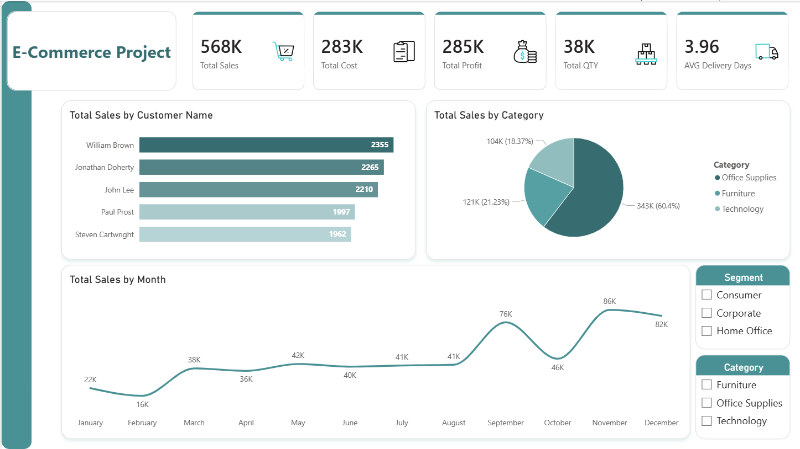
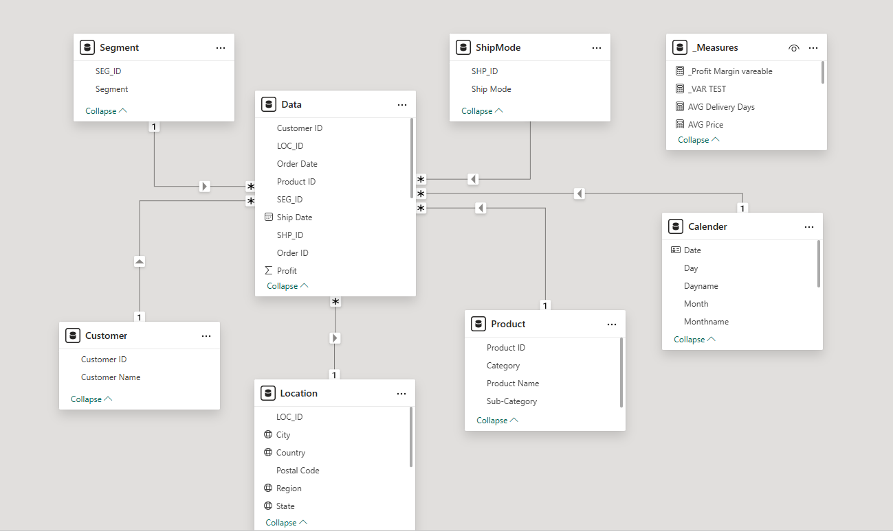
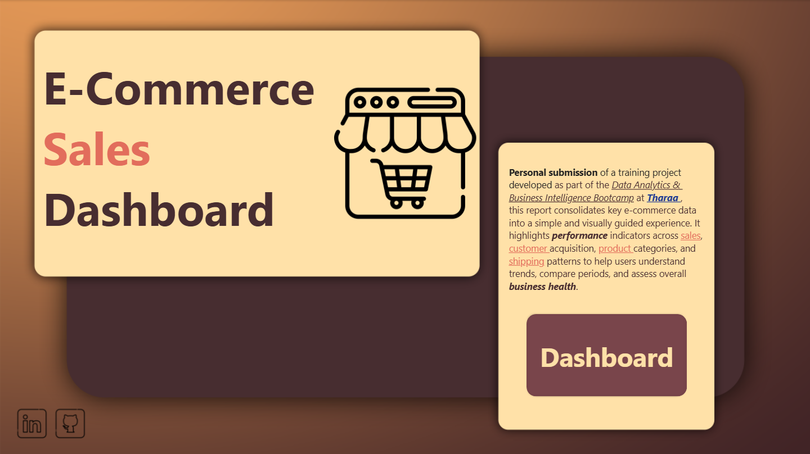
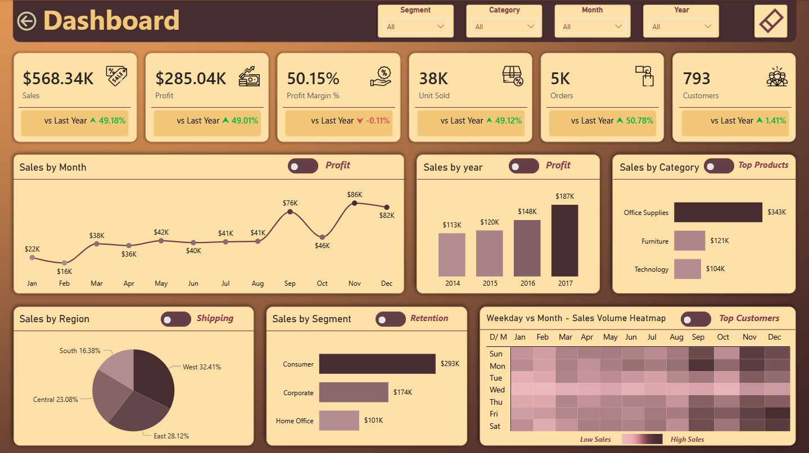
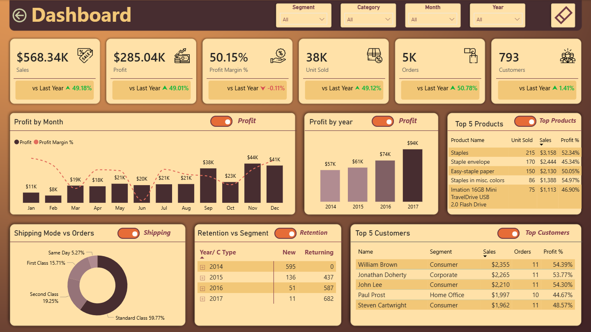
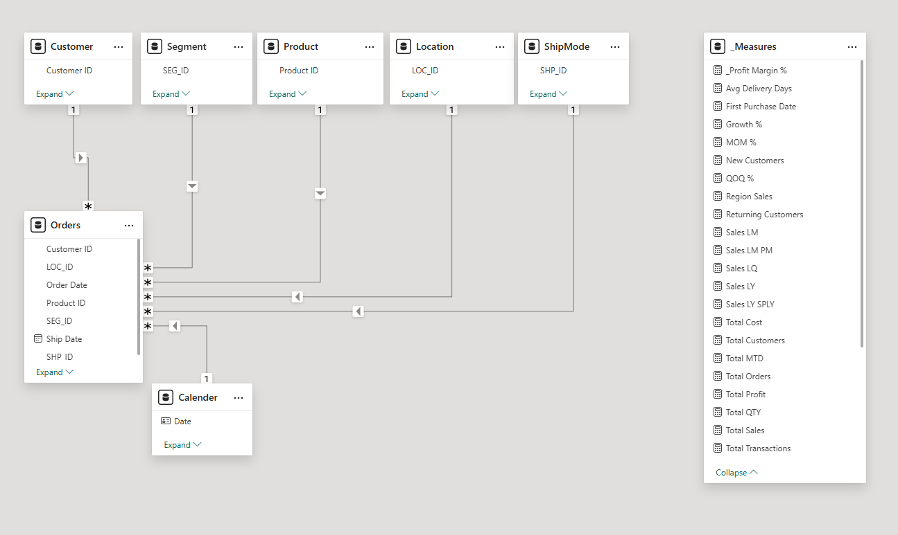

# 📊 Power BI Portfolio

A professional Power BI portfolio showcasing a clear progression from foundational dashboards to advanced data modeling, time intelligence, and interactive analytical storytelling.

---

## 🔎 Quick Navigation

* [📂 Repository Structure](#-repository-structure)
* [🚀 Projects Overview](#-projects-overview)
* [🧠 Skills Demonstrated](#-skills-demonstrated)
* [🗂 Datasets](#-datasets)
* [📌 Notes](#-notes)
* [👤 Author](#-author)

---

## 📂 Repository Structure

* 📁 **Projects**

  * 📁 [01_cafe_sales_dashboard](projects/01_cafe_sales_dashboard)
  * 📁 [02_ecommerce_sales_modeling](projects/02_ecommerce_sales_modeling)
  * 📁 [03_ecommerce_advanced_dashboard](projects/03_ecommerce_advanced_dashboard)
* 📁 **Datasets**

  * 📄 [Arabic_Coffe_Sales_Dataset.xlsx](datasets/Arabic_Coffe_Sales_Dataset.xlsx)
  * 📄 [Dataset_E-Commerce.xlsx](datasets/Dataset_E-Commerce.xlsx)

---

## 🚀 Projects Overview

### 01️⃣ Cafe Sales Dashboard

📁 **[View Project](projects/01_cafe_sales_dashboard)**

An introductory dashboard designed to present café sales performance to management.

**Key Highlights**

* KPI cards: Sales, Profit, Cost, Quantity
* Interactive slicers (Branch, Product Category, Payment Method)
* Monthly sales trends
* High-level management overview

**Preview**

---

### 02️⃣ E-Commerce Sales – Data Modeling & Analysis

📁 **[View Project](projects/02_ecommerce_sales_modeling)**

A deeper analytical project focused on data preparation and modeling best practices.

**Key Highlights**

* Data cleaning and normalization
* Star schema design (Fact & Dimension tables)
* Dedicated Calendar table
* Structured and well-organized DAX measures
* Foundational analytical dashboards

**Previews**

---

### 03️⃣ E-Commerce Sales – Advanced Interactive Dashboard

📁 **[View Project](projects/03_ecommerce_advanced_dashboard)**

An advanced solution built on the same e-commerce dataset, emphasizing interactivity, UX, and deeper analytical insights.

**Key Highlights**

* Multi-page report (Home & Dashboard)
* KPI comparison vs previous year
* Advanced time intelligence (YOY, MOM, QOQ)
* Bookmarks and toggle buttons
* Multiple analytical views within the same visual space
* Retention, shipping, top products, and customer analysis

**Previews**

---

## 🧠 Skills Demonstrated

**Analytics & Modeling**

* Power BI Desktop
* Data Modeling (Star Schema)
* KPI Design & Performance Comparison

**Data Preparation**

* Power Query (Data Cleaning & Transformation)
* Data Normalization
* Calendar Tables & Relationships

**DAX & Time Intelligence**

* DAX Measures
* YOY / MOM / QOQ Analysis
* Growth %, Profit Margin %, Retention Metrics

**Dashboard Design & UX**

* Interactive Dashboards
* Bookmarks & Toggle Buttons
* Page Navigation & Visual Storytelling

---

## 🗂 Datasets

All projects are built using structured datasets available in the [datasets](datasets) folder.

* ☕ **Café Sales Dataset** – transactional sales data used for management-level reporting
* 🛒 **E-Commerce Dataset** – normalized sales data used for modeling, analysis, and advanced dashboards

---

## 📌 Notes

* This portfolio represents practical, hands-on analytical work
* Projects are designed to reflect real business scenarios
* Additional data analysis projects are currently in progress
* The repository will continue to evolve as new projects are completed

---

## 👤 Author

**Mohamed Hajali**
Power BI & Data Analytics

GitHub: [https://github.com/MohamedHajali95](https://github.com/MohamedHajali95)
Repository: [https://github.com/MohamedHajali95/powerbi-portfolio](https://github.com/MohamedHajali95/powerbi-portfolio)
