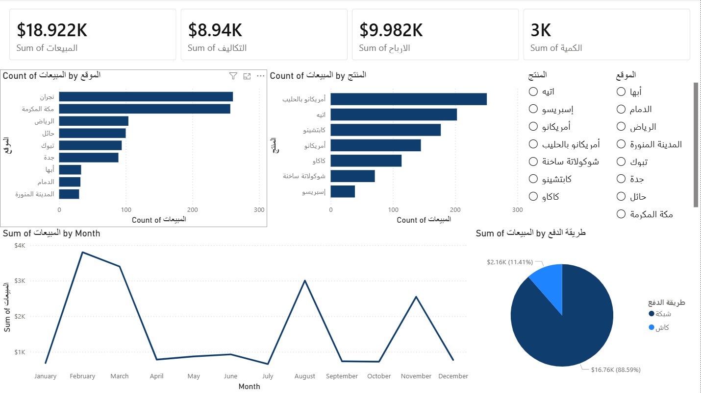

# 01. Cafe Sales Dashboard

An introductory Power BI dashboard created to present sales performance for a café business with clarity and management-focused insights.

---

## 🎯 Objective

To provide a clear and interactive dashboard that enables stakeholders to explore café sales performance by branch, product category, and payment method.

---

## 📌 What’s Included

- Power BI Desktop report file (`cafe_sales_dashboard.pbix`)
- Interactive visuals:
  - KPI cards (Sales, Profit, Cost, Quantity)
  - Slicers for Branch, Product Category, and Payment Method
  - Trend visuals by Month
- Data source used: **Arabic_Coffe_Sales_Dataset.xlsx**

---

## 📊 Highlights

- Clean KPI summary for quick business insight
- Filters that allow dynamic exploration of branches and product categories
- Dashboard designed for ease-of-use by non-technical users

---

## 👀 Preview

---

## 📁 Files

- `cafe_sales_dashboard.pbix` – Power BI report
- `screenshot_dashboard.png` – Dashboard preview
