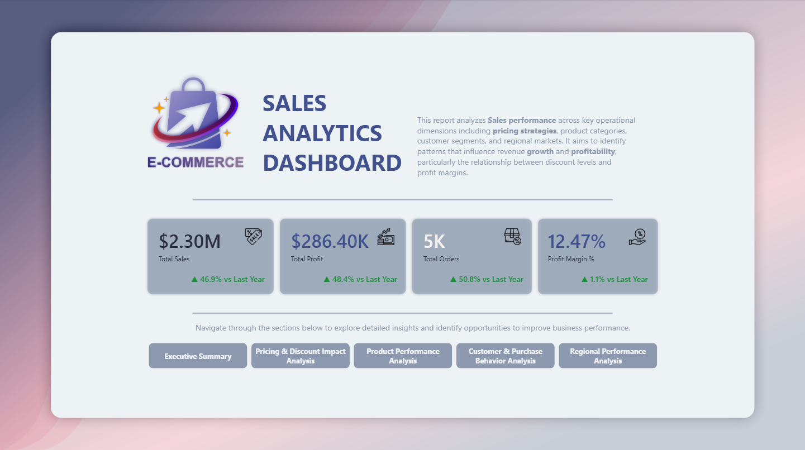
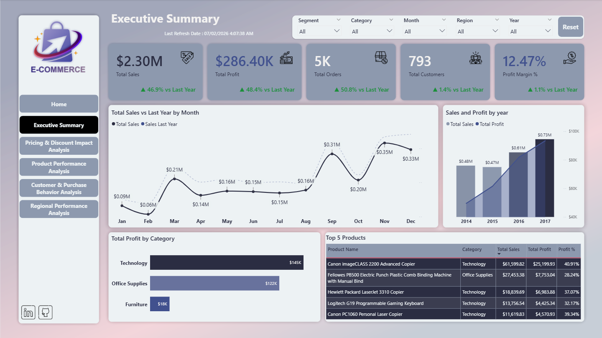
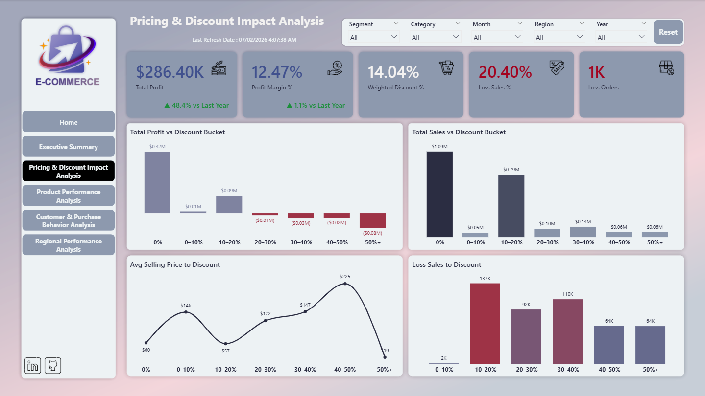
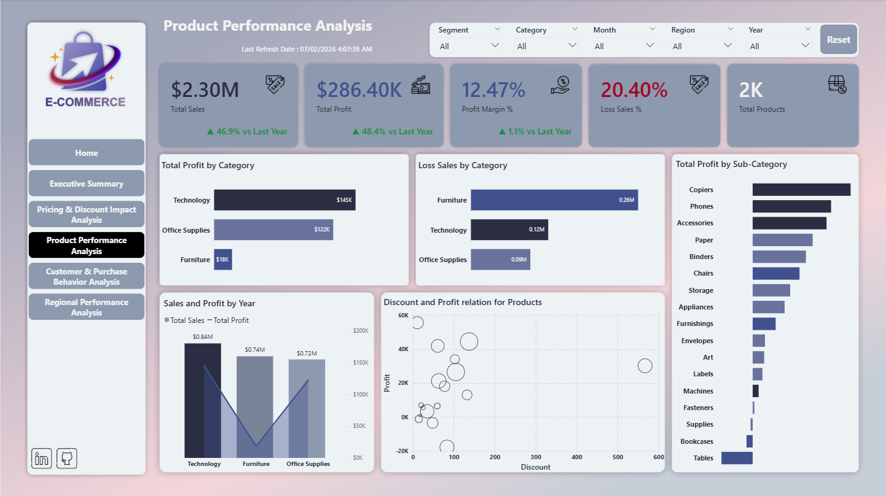
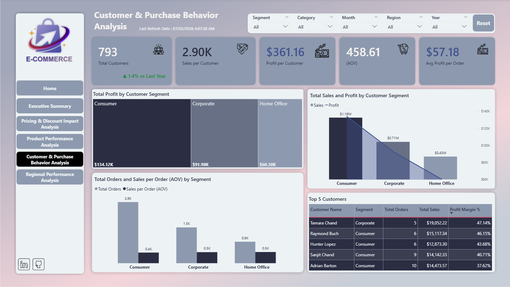
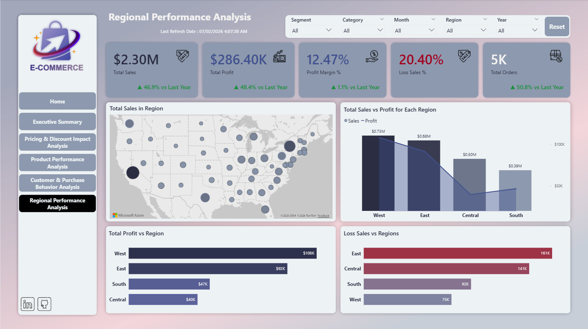
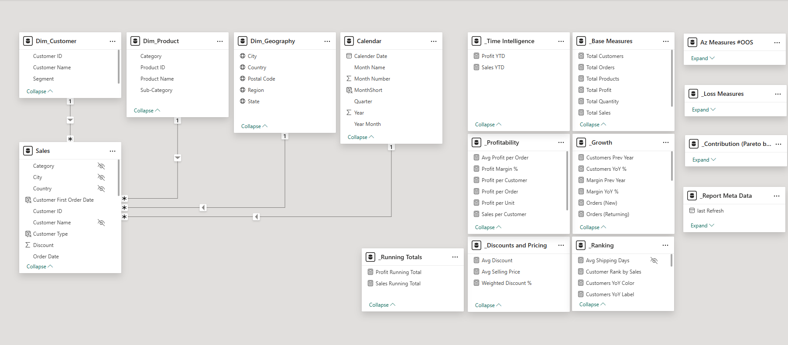

# 04. Superstore Sales Analytics Dashboard

A multi-page Power BI project built on the Superstore dataset, focusing on sales performance, pricing impact, product insights, customer behavior, and regional analysis.

---

## 🎯 Objective

To provide decision-makers with an interactive dashboard that enables deeper exploration of sales trends, profitability drivers, discount effects, customer purchasing behavior, and regional performance.

---

## 📌 What’s Included

- Power BI Desktop report file (`Superstore_Sales_Analytics_Dashboard.pbix`)
- Multi-page report with guided home page navigation
- Advanced KPI cards with previous year comparison
- Dedicated analytical pages for pricing, products, customers, and regions
- Organized DAX measures using Display Folders

---

## 📊 Highlights

- Interactive home page with section-based navigation
- Executive summary with core KPIs
- Pricing & discount impact analysis
- Product performance and sub-category profitability analysis
- Customer and purchase behavior analysis
- Regional performance analysis with map visualization
- Structured data model with clean relationships and organized measures

---

## 👀 Previews

**Home Page**

**Executive Summary**

**Pricing & Discount Impact Analysis**

**Product Performance Analysis**

**Customer & Purchase Behavior Analysis**

**Regional Performance Analysis**

**Data Model**

---

## 📁 Files

- `Superstore_Sales_Analytics_Dashboard.pbix` – Power BI report
- `screenshot_home.png` – Home page preview
- `screenshot_executive.png` – Executive summary preview
- `screenshot_pricing.png` – Pricing and discount analysis preview
- `screenshot_product.png` – Product performance analysis preview
- `screenshot_customer.png` – Customer and purchase behavior analysis preview
- `screenshot_region.png` – Regional performance analysis preview
- `screenshot_model.png` – Data model view
